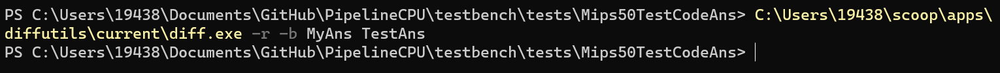

# MIPS32五级流水全旁路CPU设计

## 1  设计概述

本实验使用System Verilog语言设计了一个基于MIPS 32指令集的五级流水全旁路CPU。

### 1.1  指令集支持

它支持50条指令，如下所示：

* ALU类型： `ADD / ADDU / SUB / SUBU / SLL / SRL / SRA / SLLV / SRLV / SRAV / AND / OR / XOR / NOR / SLT / SLTU`
* 加载立即数到高位： `LUI`
* 带有立即数的ALU类型： `ADDI / ADDIU / ANDI / ORI / XORI / SLTI / SLTIU`
* 访存类型： `LB / LBU / LH / LHU / LW / SB / SH / SW`
* 分支类型： `BEQ / BNE / BLEZ / BGTZ / BGEZ / BLTZ`
* 无条件跳转类型： `JR / JALR / J / JAL`
* 乘除及LOHI寄存器类型： `MULT / MULTU / DIV / DIVU / MFHI / MTHI / MFLO / MTLO`
* 其他： `SYSCALL / NOP`

### 1.2  组件架构

它包含了五级流水线和其他必要的组件，结构如下：

* 取指模块（InstructionFetch）
  * 程序计数器（ProgramCounter）
  * 指令内存（InstructionMemory）
* 译码模块（InstructionDecode）
  * 控制单元（ControllerUnit）
  * 分支数据转发模块（ForwardingBranch）
* 执行模块（Execution）
  * 算术逻辑单元（ArighmaticLogicUnit）
  * 乘除运算单元（MultiplicationDivisionUnit）
  * 符号扩展单元（SignExtendUnit）
  * ALU、MDU数据转发模块（ForwardingALU）
* 访存模块（Memory）
  * 数据内存（DataMemory）
* 回写寄存器模块（WriteBack）
* 通用寄存器堆（GeneralPurposeRegisters）
* 转发控制单元（ForwardingUnit）
* 阻塞控制单元（BlockingUnit）
* 日志输出单元（Printer）

流水线间寄存器共四个，分别在五级流水阶段之间。

## 2  控制信号设计

CPU中的控制信号设计如下所示：

```systemverilog
typedef struct packed {
    RegWriteDst_t regWriteDst; // Which register is going to be written
    RegWriteSrc_t regWriteSrc; // What data is going to be written into register
    ALUSrc_t aluSrc; // What are ALU&MDU's operands from
    PCSrc_t pcSrc; // What is new PC value from
    ALUOp_t aluOp; // What is ALU's operator

    logic special; // Whether it uses MDU
    logic regWriteEnabled; // Whether it writes register
    logic memReadEnabled; // Whether it reads data memory
    logic memWriteEnabled; // Whether it writes data memory
    logic branch; // Whether it modifies PC value
    logic realBranch; // Whether the branch needs conditions
} ControlSignal;
```

对于前半部分的多值信号，使用枚举`enum`类型包装。实现控制单元时，使用硬布线的方式，通过`casex`分支，对相似的指令进行分类，之后赋上其对应的控制信号值。

控制信号在译码阶段根据赋给流水线间寄存器，随后将随流水线移动，并在不同的阶段指导不同的元件。

## 3  竞争冒险处理

### 3.1  全旁路转发设计

首先，设计转发控制单元，根据`ID_EX`、`EX_MEM`、`MEM_WB`流水线间寄存器的值，确定位于`IF_ID`、`ID_EX`寄存器中指令所使用通用寄存器数据的来源，以分别应对控制冒险和数据冒险。对于非零的通用寄存器地址，转发控制单元按照由先及后的顺序，依次判断不同流水线间寄存器的数据有效性，并发出信号。转发信号如下定义：

```systemverilog
typedef enum Vec2
{
    Forwarding_GPR = 2'b00, // From Register Files
    Forwarding_EX_MEM = 2'b01, // From Last time ALU Result
    Forwarding_MEM_WB = 2'b10,  // From DM or The Second Last ALU Result
    Forwarding_ID_EX = 2'b11 // For Control Hazard, need to wait ALU's result
} Forwarding_t;
```

其次，设计数据转发单元。对于数据冒险而言，根据`EX_MEM`和`MEM_WB`寄存器的值，获取到最新的通用寄存器值作为ALU操作数。对于控制冒险而言，根据`ID_EX`、`EX_MEM`、`MEM_WB`等寄存器的值，确定分支判断操作数的最新值，并给出是否需要阻塞的信号。

### 3.2  阻塞控制

此设计中的“阻塞”定义如下。一旦阻塞信号发出，则：

* 下一时钟信号到来时，PC值保持不变；
* 下一时钟信号到来时，`IF_ID`寄存器保持不变；
* 下一时钟信号到来时，`ID_EX`寄存器清零。

这等价于在下一时钟信号到来之时，使取指、译码阶段指令保持，并在执行阶段插入`NOP`指令。

阻塞控制单元会根据输入的`IF_ID`、`ID_EX`寄存器判断是否存在需要阻塞的数据冒险，以及由控制冒险旁路单元发出的是否需要阻塞信号，和`MDU`发出的“忙”信号给出CPU的阻塞信号，发送给取指和译码模块。阻塞情况为下面情况任一成立：

* 取指阶段结束的指令将在执行阶段需要访问刚刚译码结束的指令待写回的数据，且待写回数据由内存读而产生；
* 控制冒险旁路单元指出需要阻塞；
* 取指结束的指令乘除法或LOHI寄存器访问指令，且下面情况任一成立：
  * `MDU`正忙；
  * 刚译码结束的指令为乘除法。

## 4  功能测试

### 4.1  测试方法

使用`Mars.jar`对不同的测试汇编文件生成写寄存器堆、数据内存的日志；与日志输出单元`Printer`输出的文件做对照。

### 4.2  测试结果

对于不同的指令，编写并通过了个性化小型测试点，如下所示：

* `add-series`：整体框架与数据冒险测试
* `branch-series`：分支指令与控制冒险测试
* `arith-series`：ALU运算系列指令测试
* `memory-series`：内存读写系列指令测试
* `multi-series`：乘除指令及LOHI寄存器读写测试

随后，使用`Mips50TestCodeAns`中的综合测试进行测试，本CPU生成的输出在`MyAns`文件夹中，使用`GNU diff`同标准答案对比后，结果如下图所示。所有的测试点均通过，未与标准答案存在非空格类不同。



## 5  总结与展望

本设计完成了一个MIPS32架构的五级流水CPU模型，并实现了完整的旁路和转发。功能方面，测试正常，可以应对指令集定义的绝大多数情况；性能方面，与不使用多发射、分支预测等优化技术的CPU模型的时钟周期消耗相差在常数级别。

综合来看，本设计最大的缺陷在于阻塞控制较为单一（可能会造成乘除指令时额外的阻塞周期）。同时，也可以考虑加上简单的分支预测技术来优化性能。
